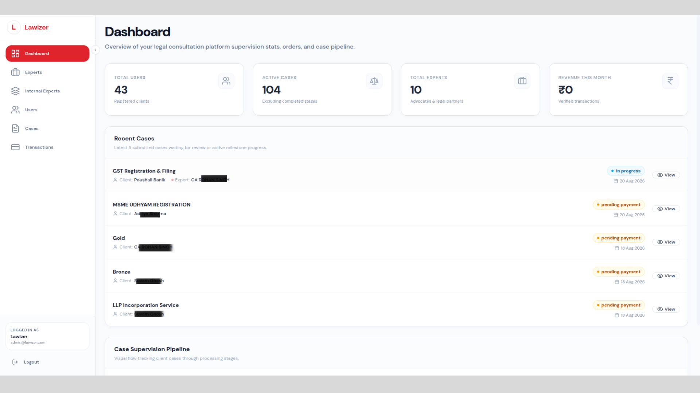
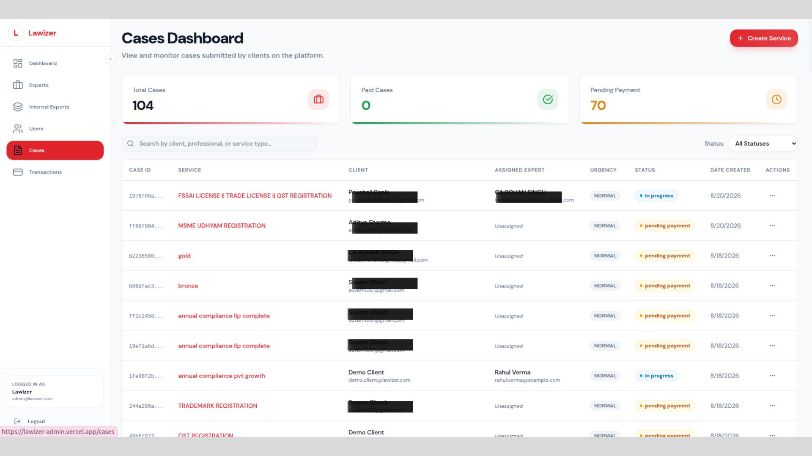
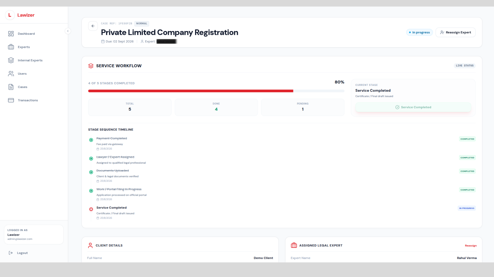
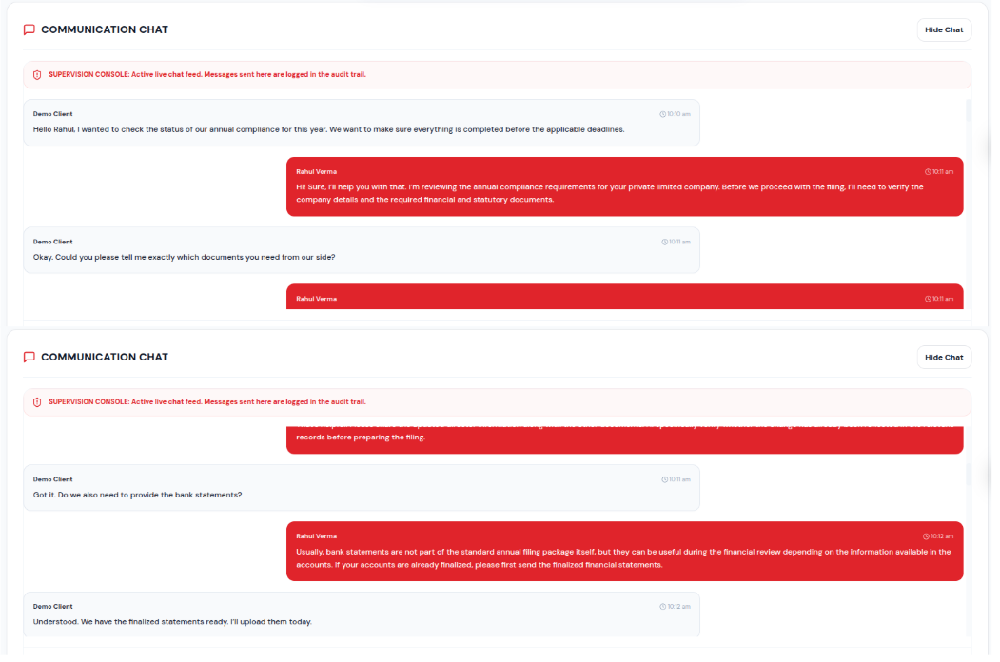
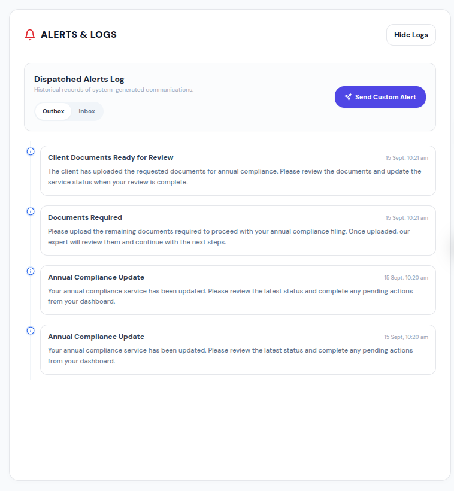
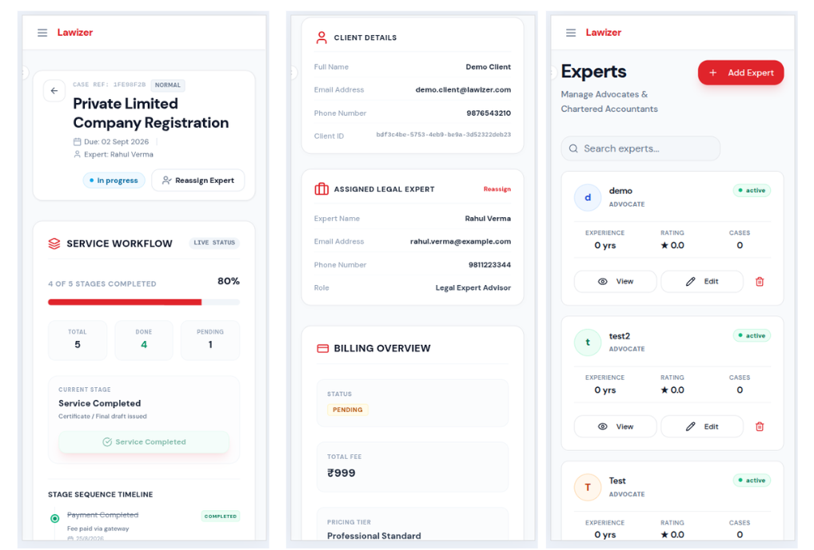

# Lawizer Admin Dashboard

### Frontend Engineering Case Study

A production LegalTech administration platform for supervising cases, legal-service workflows, experts, users, transactions, documents, communication, and operational notifications.

> **Role:** Frontend Developer
> **Project Type:** Production B2B Admin Platform
> **Repository:** Case Study — Production Source Code is Private
> **Tech:** React · TypeScript · Vite · Tailwind CSS · Shadcn UI · Axios · REST APIs

---

## 📌 About This Case Study

I worked on the frontend of the **Lawizer Admin Dashboard**, an internal administration platform used to supervise legal-service operations.

My contribution went beyond implementing individual screens. I worked across API integration, service supervision workflows, responsive architecture, authentication, chat pagination, notifications, transactions, documents, state management, and reusable UI components.

The actual production repository is private and contains proprietary company code.

This repository therefore focuses on:

* the problems I worked on
* frontend architecture
* engineering decisions
* major features I implemented
* technical challenges
* responsive design
* selected product visuals

No production source code, credentials, customer information, or private API details are included.

---

# 🖥️ Product Overview



The Lawizer Admin Dashboard provides administrators with a centralized interface for managing and supervising platform operations.

The product includes:

* Platform dashboard and operational metrics
* User management
* Expert management
* Case management
* Service supervision
* Expert assignment
* Service workflow tracking
* Document management
* Admin communication
* Calls and consultation logs
* Notifications and alerts
* Transactions

---

# 👩‍💻 My Role

I contributed as a **Frontend Developer**, working primarily with React and TypeScript.

My responsibilities included:

* Building production dashboard interfaces
* Integrating REST APIs
* Developing reusable UI components
* Implementing responsive layouts
* Handling frontend state and data transformation
* Building loading, empty, and error states
* Implementing authentication flows
* Developing service supervision workflows
* Building chat pagination behavior
* Integrating notification workflows
* Improving mobile usability
* Collaborating with backend development around API contracts

---

# 🧰 Tech Stack

| Area           | Technologies                                             |
| -------------- | -------------------------------------------------------- |
| Frontend       | React, TypeScript                                        |
| Build Tool     | Vite                                                     |
| Styling        | Tailwind CSS                                             |
| UI Components  | Shadcn UI                                                |
| Networking     | Axios                                                    |
| APIs           | REST                                                     |
| Authentication | Token-based authentication                               |
| State          | React state, Context, domain-level state transformations |
| Responsive UI  | Tailwind breakpoints, responsive component abstractions  |

---

# 🏗️ Frontend Architecture

The frontend separates presentation, domain logic, authentication, and network communication.

```text
┌─────────────────────────────────────────────┐
│                 Admin UI                    │
│                                             │
│ Dashboard · Services · Users · Transactions │
└──────────────────────┬──────────────────────┘
                       │
                       ▼
┌─────────────────────────────────────────────┐
│           Components / Feature UI           │
│                                             │
│ Chat · Documents · Calls · Notifications    │
│ Modals · Cards · Tables · Workflow          │
└──────────────────────┬──────────────────────┘
                       │
                       ▼
┌─────────────────────────────────────────────┐
│          Domain / Service Layer             │
│                                             │
│ Mapping · State Transitions · Normalization │
│ Data Composition · Feature Logic            │
└──────────────────────┬──────────────────────┘
                       │
                       ▼
┌─────────────────────────────────────────────┐
│              API Layer                     │
│                                             │
│ Centralized API Functions · Axios Client    │
│ Authorization · Error Handling              │
└──────────────────────┬──────────────────────┘
                       │
                       ▼
                 Backend APIs
```

This separation helped keep network and transformation logic away from presentation components.

---

# ⭐ Featured Engineering Work

## 01 — Unified Service Supervision

One of the largest areas I worked on was the **Service Supervision experience**.

Administrators need to understand the complete state of a legal service while also accessing related documents, communications, calls, notifications, expert information, and workflow progress.

Instead of treating these as unrelated screens, the frontend brings them together around the active service.



### Responsibilities

I worked on:

* Service/case selection
* Service detail presentation
* Workflow tracking
* Expert assignment
* Documents
* Communication
* Calls
* Notifications
* Loading and API states
* Responsive presentation

### Design approach

```text
Service / Case
      │
      ├── Overview
      │
      ├── Workflow
      │
      ├── Documents
      │
      ├── Communication
      │
      ├── Calls
      │
      └── Notifications
```

The goal was to keep related operational information available within the context of the selected service.

---

# 🔄 Service Workflow Management

Legal services move through multiple operational stages.

The frontend provides administrators with:

* Current workflow stage
* Overall completion percentage
* Completed stages
* Pending stages
* Stage sequence
* Expert assignment state
* Actions for progressing the workflow



Rather than mutating workflow state directly, stage transitions are handled using predictable immutable state transformations.

Conceptually:

```text
Payment Completed
        ↓
Lawyer / Expert Assigned
        ↓
Documents Uploaded
        ↓
Work / Portal Filing
        ↓
Service Completed
```

This keeps workflow progression easier to reason about as the interface becomes more complex.

---

# 💬 Cursor-Based Infinite Chat

One of the more interesting frontend problems I worked on involved historical chat pagination.

## The Problem

Chat history is loaded incrementally.

When older messages are inserted at the **top** of a conversation, simply prepending them changes the container's height.

Without compensating for that change, the administrator's viewport jumps unexpectedly.

```text
Load older messages
        ↓
Prepend messages
        ↓
Container height increases
        ↓
Viewport moves ❌
```

## The Solution

I implemented cursor-based pagination together with scroll-position anchoring.

The frontend records the previous scroll dimensions before loading historical messages.

After the new messages are rendered, it calculates the increase in scroll height and compensates for that difference.

```text
Previous Scroll Height
        │
        ▼
Fetch Older Messages
        │
        ▼
Prepend Messages
        │
        ▼
Measure New Scroll Height
        │
        ▼
Calculate Height Difference
        │
        ▼
Restore Relative Scroll Position
```

`useLayoutEffect` is used during this process so the adjustment happens alongside layout updates.

### Result

The administrator remains anchored around the messages they were already reading instead of being moved to a different part of the conversation.



### Engineering takeaway!

Infinite chat is not only a pagination problem.

It is also a **DOM measurement and viewport-management problem**.

---

# 🔔 Notification & Alerts Management

I also worked on the administrative notification experience.

The system separates notifications into **Inbox** and **Outbox** views so administrators can distinguish between incoming activity and communications dispatched from the administration platform.



### Functionality

* Inbox / Outbox switching
* Notification API integration
* Notification mapping
* Frontend caching
* Loading states
* Empty states
* Error handling
* Custom notification composer
* Recipient targeting
* Important notification state

This feature required coordinating API data, local UI state, and multiple notification views without unnecessary re-fetching.

---


# 📱 Responsive Admin Architecture

A major part of my work involved improving the dashboard for smaller screens.

Complex administration interfaces often rely on:

* wide tables
* multi-column layouts
* dialogs
* dense forms
* large amounts of operational information

Simply shrinking these layouts creates poor mobile experiences.

Instead, I worked on responsive presentation patterns.



## Responsive Component Strategy

I built reusable responsive UI abstractions rather than solving each page independently.

One example was a responsive modal pattern capable of adapting its presentation according to the available viewport.

```text
Large Screen
     ↓
Desktop Dialog

Smaller Screen
     ↓
Sheet / Drawer

Mobile
     ↓
Touch-friendly mobile presentation
```

Other responsive work included:

* Mobile user cards
* Transaction cards
* Responsive drawers
* Scrollable content regions
* Mobile navigation
* Touch-friendly actions
* Responsive service workflow
* Layout overflow handling

### Engineering takeaway

Responsive design became a **component architecture concern**, rather than a final CSS cleanup task.

---

# 💳 Responsive Transactions

Transaction data works naturally inside a table on desktop but becomes difficult to scan when that table is compressed onto a mobile screen.

Instead of forcing the same presentation everywhere, I worked on different representations for different viewport constraints.

### Desktop

```text
┌─────────────────────────────────────────────────────┐
│ ID │ Client │ Amount │ Status │ Date │ Actions     │
└─────────────────────────────────────────────────────┘
```

### Mobile

```text
┌─────────────────────────────┐
│ Transaction #...            │
│                             │
│ Client                      │
│ Amount                      │
│ Status                      │
│ Date                        │
│                             │
│              View Details → │
└─────────────────────────────┘
```

A transaction drawer provides additional details without forcing large desktop layouts onto mobile devices.

---

# 🌐 API Integration & Data Layer

The application communicates with multiple backend resources.

Instead of embedding request logic directly throughout UI components, the frontend uses a centralized API layer.

```text
UI Component
      ↓
Feature / Domain Logic
      ↓
API Function
      ↓
Axios Client
      ↓
Backend
```

Responsibilities handled around this layer include:

* Request configuration
* Authorization headers
* API response handling
* Error states
* Data normalization
* Domain mapping

---

# 🔀 Client-Side Data Composition

Sometimes a single interface requires information originating from different backend resources.

For example:

```text
Cases API ─────────┐
                   │
                   ├──► Frontend Mapping ──► UI Model
                   │
Transactions API ──┘
```

I worked on client-side data mapping where related resources needed to be combined before being consumed by the UI.

Keeping this transformation outside presentation components helped reduce coupling between backend response structures and UI rendering.

---

# 🔐 Authentication

I worked on the admin authentication flow, including:

* Login UI
* Form validation
* Authentication state
* Session persistence
* Authorization headers
* Protected dashboard access
* Unauthenticated redirects
* Authentication error states

Security-sensitive implementation details are intentionally excluded from this public case study.

---

# 🧩 Reusable Frontend Components

Several areas of the dashboard benefited from reusable abstractions.

Examples include:

```text
ResponsiveModal
StatusBadge
DataTable
UserCard
TransactionCard
TransactionDrawer
ChatTab
DocumentsTab
NotificationsTab
```

The objective was not simply to reduce duplicate JSX.

Reusable components also helped establish consistent behavior for:

* responsive presentation
* loading states
* status visualization
* modal interactions
* data presentation

---

# 🧠 Engineering Challenges

## 1. Maintaining chat position during pagination

**Challenge:** Prepending older messages changed the scroll height.

**Approach:** Measure the previous and new heights and compensate for the difference after rendering.

---

## 2. Making data-heavy interfaces mobile-friendly

**Challenge:** Tables and desktop dialogs did not translate well to narrow screens.

**Approach:** Introduce cards, drawers, responsive layouts, and reusable presentation abstractions.

---

## 3. Coordinating multiple service features

**Challenge:** Documents, chat, workflow, calls, experts, and notifications all depend on the currently selected service.

**Approach:** Keep service context centralized while allowing feature sections to manage their own loading and interaction states.

---

## 4. Handling backend data for frontend requirements

**Challenge:** API response structures do not always match the shape required by the UI.

**Approach:** Introduce mapping and normalization between the network and presentation layers.

---

## 5. Managing network states

Production interfaces must handle more than successful responses.

I worked with states including:

```text
Loading
   ↓
Success ──────────► Render Data
   │
   ├──────────────► Empty State
   │
   └──────────────► Error / Not Found
```

---

# 📈 Contribution Areas

My production contribution covered multiple parts of the frontend:

| Area                | Contribution                                      |
| ------------------- | ------------------------------------------------- |
| Authentication      | Admin authentication and protected access         |
| Users               | User management and responsive presentation       |
| Experts             | Expert management and registration integration    |
| Cases               | Case APIs and expert assignment                   |
| Service Supervision | Unified service supervision experience            |
| Workflow            | Stage visualization and workflow interactions     |
| Documents           | Document API integration and UI states            |
| Chat                | Cursor pagination and scroll anchoring            |
| Notifications       | Inbox/Outbox and notification composition         |
| Responsive UI       | Reusable responsive components and mobile layouts |

---

# 📚 What I Learned

Working on a production admin platform changed how I approach frontend engineering.

### API integration is more than `fetch()`

Real integrations require:

* loading states
* error handling
* data transformation
* pagination
* caching
* authentication
* synchronization with UI state

### Responsive design starts at the component level

Responsive applications are easier to maintain when components are designed around different viewport constraints from the beginning.

### UX problems can become engineering problems

The infinite-chat scroll issue is a good example: a small visual jump required understanding browser layout behavior and React's rendering lifecycle.

### Separation of concerns matters as products grow

Separating API communication, domain transformations, and presentation makes complex interfaces easier to understand and modify.

### Production development requires working across boundaries

Frontend work often involves understanding backend contracts, business workflows, edge cases, and product requirements—not only implementing designs.

---

# 🗂️ Case Study Repository Structure

```text
lawizer-admin-dashboard-case-study/
│
├── README.md
│
├── assets/
│   ├── dashboard-overview.png
│   ├── service-supervision.png
│   ├── service-workflow.png
│   ├── chat.png
│   ├── notifications.png
│   ├── calls-alerts.png
│   └── mobile-service-workflow.png

```

---

# 🔒 Source Code & Confidentiality

Lawizer is a production company project.

The original source repository is private and is **not included in this repository**.

This case study contains only approved documentation and sanitized product visuals.

It intentionally excludes:

* Production source code
* Credentials and secrets
* Environment variables
* Authentication tokens
* Private API URLs
* Customer information
* Internal database information
* Confidential business data

Product screenshots used in this case study are sanitized before publication.

---

# 👩‍💻 Developer

**Kareena Yadav**

Frontend Developer

Worked on frontend architecture, production feature development, API integrations, responsive interfaces, workflow management, and administrative tooling for the Lawizer platform.

---

## Disclaimer

This repository is an independent engineering case study documenting my contribution to the Lawizer Admin Dashboard.

It is **not the official Lawizer source-code repository**.

All proprietary source code remains private and belongs to its respective owner.
